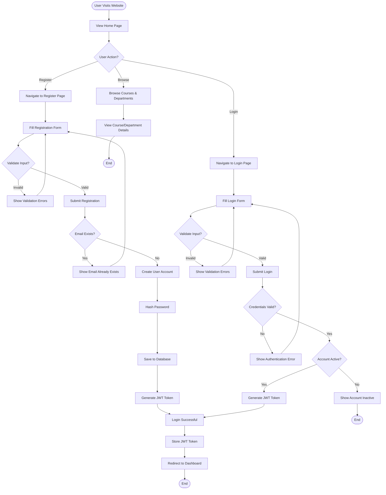
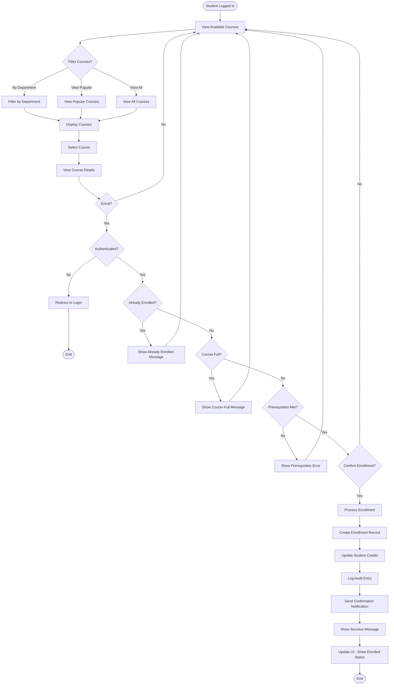
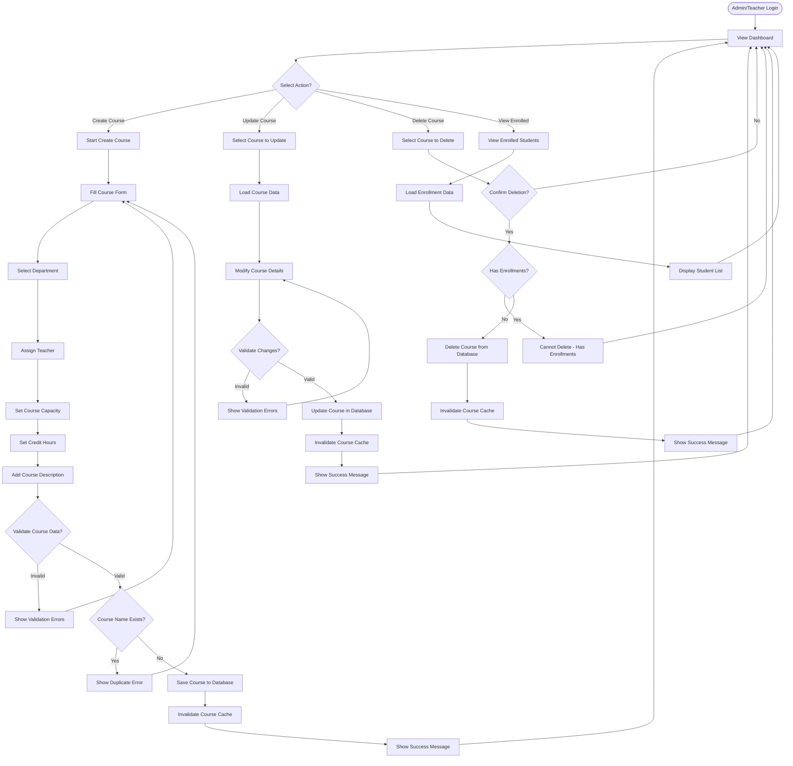
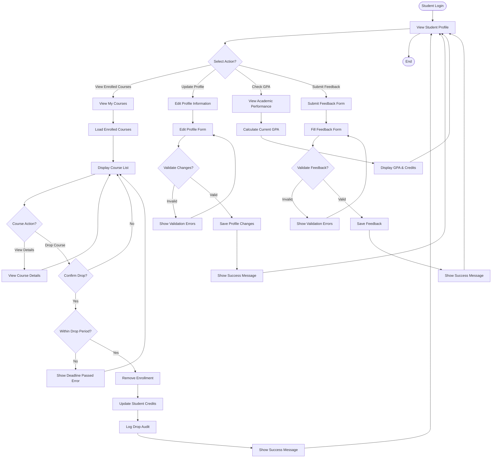

# UniSystem - Activity Diagrams

This document contains activity diagrams showing the business process flows of the UniSystem application.

## 1. User Registration & Authentication Process

## 2. Course Enrollment Process

## 3. Course Management Process (Admin/Teacher)

## 4. Student Profile Management Process

## 5. System Administration Process

```mermaid
flowchart TD
    Start([Admin Login]) --> AdminDashboard[View Admin Dashboard]
    AdminDashboard --> AdminAction{Select Action?}
    
    AdminAction -->|Manage Users| UserMgmt[User Management]
    AdminAction -->|Manage Departments| DeptMgmt[Department Management]
    AdminAction -->|View Audit Logs| ViewAudit[View Audit Logs]
    AdminAction -->|Manage Teachers| TeacherMgmt[Teacher Management]
    AdminAction -->|System Reports| Reports[Generate Reports]
    
    %% User Management
    UserMgmt --> UserAction{User Action?}
    UserAction -->|Create User| CreateUser[Create New User]
    UserAction -->|Update User| UpdateUser[Update User Details]
    UserAction -->|Deactivate User| DeactivateUser[Deactivate User Account]
    UserAction -->|Assign Roles| AssignRoles[Assign User Roles]
    
    CreateUser --> FillUserForm[Fill User Form]
    FillUserForm --> ValidateUser{Validate User Data?}
    ValidateUser -->|Invalid| ShowUserError[Show Validation Errors]
    ShowUserError --> FillUserForm
    ValidateUser -->|Valid| SaveUser[Save User to Database]
    SaveUser --> AdminDashboard
    
    %% Department Management
    DeptMgmt --> DeptAction{Department Action?}
    DeptAction -->|Create Department| CreateDept[Create New Department]
    DeptAction -->|Update Department| UpdateDept[Update Department]
    DeptAction -->|Delete Department| DeleteDept[Delete Department]
    
    CreateDept --> FillDeptForm[Fill Department Form]
    FillDeptForm --> ValidateDept{Validate Department?}
    ValidateDept -->|Invalid| ShowDeptError[Show Validation Errors]
    ShowDeptError --> FillDeptForm
    ValidateDept -->|Valid| CheckDeptDup{Department Exists?}
    CheckDeptDup -->|Yes| ShowDeptDupError[Show Duplicate Error]
    ShowDeptDupError --> FillDeptForm
    CheckDeptDup -->|No| SaveDept[Save Department]
    SaveDept --> AdminDashboard
    
    %% Audit Logs
    ViewAudit --> FilterAudit{Filter Logs?}
    FilterAudit -->|By Date| FilterByDate[Filter by Date Range]
    FilterAudit -->|By User| FilterByUser[Filter by User]
    FilterAudit -->|By Action| FilterByAction[Filter by Action Type]
    FilterByDate --> DisplayAudit[Display Audit Logs]
    FilterByUser --> DisplayAudit
    FilterByAction --> DisplayAudit
    DisplayAudit --> AdminDashboard
    
    %% Teacher Management
    TeacherMgmt --> TeacherAction{Teacher Action?}
    TeacherAction -->|Create Teacher| CreateTeacher[Create New Teacher]
    TeacherAction -->|Update Teacher| UpdateTeacher[Update Teacher Info]
    TeacherAction -->|Assign Courses| AssignCourses[Assign Courses to Teacher]
    
    CreateTeacher --> FillTeacherForm[Fill Teacher Form]
    FillTeacherForm --> ValidateTeacher{Validate Teacher?}
    ValidateTeacher -->|Invalid| ShowTeacherError[Show Validation Errors]
    ShowTeacherError --> FillTeacherForm
    ValidateTeacher -->|Valid| SaveTeacher[Save Teacher]
    SaveTeacher --> AdminDashboard
    
    %% Reports
    Reports --> SelectReport{Report Type?}
    SelectReport -->|Enrollment Stats| EnrollmentReport[Generate Enrollment Statistics]
    SelectReport -->|Course Popularity| PopularityReport[Generate Popularity Report]
    SelectReport -->|Student Performance| PerformanceReport[Generate Performance Report]
    SelectReport -->|Department Stats| DeptReport[Generate Department Statistics]
    
    EnrollmentReport --> DisplayReport[Display Report]
    PopularityReport --> DisplayReport
    PerformanceReport --> DisplayReport
    DeptReport --> DisplayReport
    DisplayReport --> ExportOption{Export Report?}
    ExportOption -->|Yes| ExportReport[Export to PDF/Excel]
    ExportOption -->|No| AdminDashboard
    ExportReport --> AdminDashboard
    
    UpdateUser --> AdminDashboard
    DeactivateUser --> AdminDashboard
    AssignRoles --> AdminDashboard
    UpdateDept --> AdminDashboard
    DeleteDept --> AdminDashboard
    UpdateTeacher --> AdminDashboard
    AssignCourses --> AdminDashboard
```

## Business Rules

### Enrollment Rules
1. Student must be authenticated
2. Student cannot enroll in the same course twice
3. Course must have available capacity
4. Prerequisites must be met (if applicable)
5. Student must have sufficient credit allowance

### Course Management Rules
1. Course name must be unique
2. Course must be assigned to a valid department
3. Course must have an assigned teacher
4. Course cannot be deleted if it has active enrollments
5. Course capacity must be greater than 0

### User Management Rules
1. Email must be unique across all users
2. Username must be unique
3. Password must meet security requirements
4. Users inherit permissions from assigned roles
5. Inactive users cannot login

### Feedback Rules
1. Only authenticated users can submit feedback
2. Feedback must include user role
3. Feedback is timestamped automatically
4. All feedbacks are stored for analytics

### Audit Logging
1. All CRUD operations are logged
2. User actions are tracked with timestamps
3. Changes include before/after states
4. Logs are immutable once created
