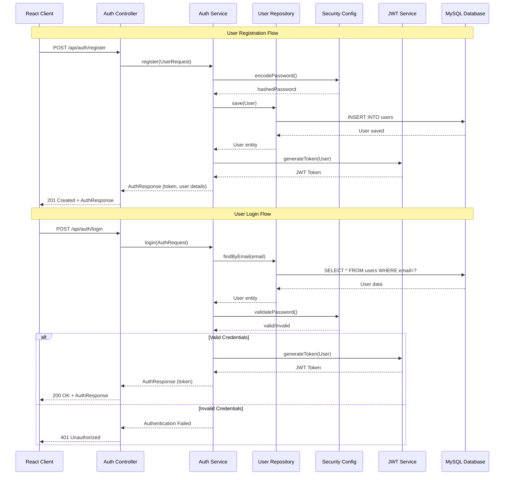
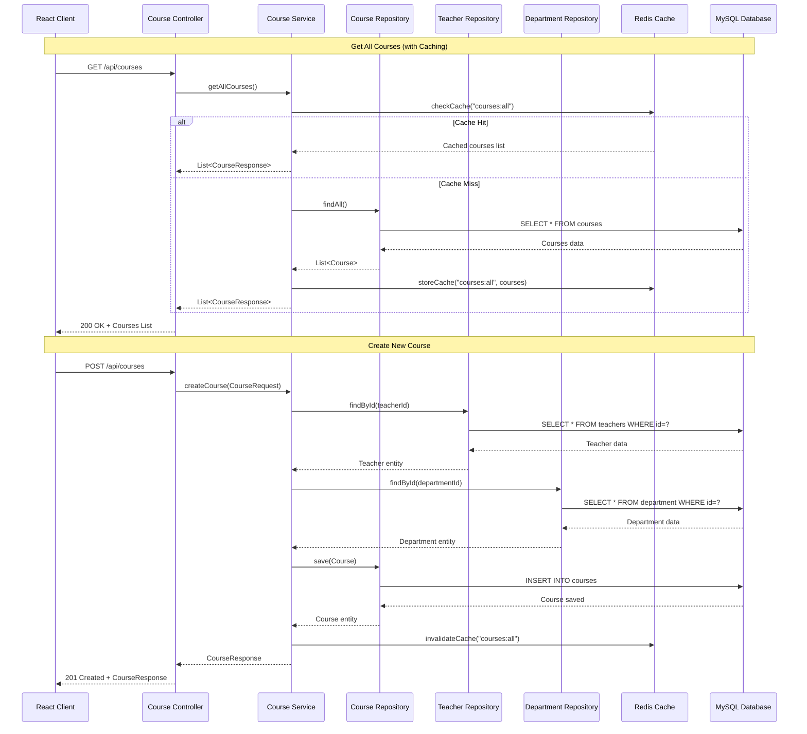
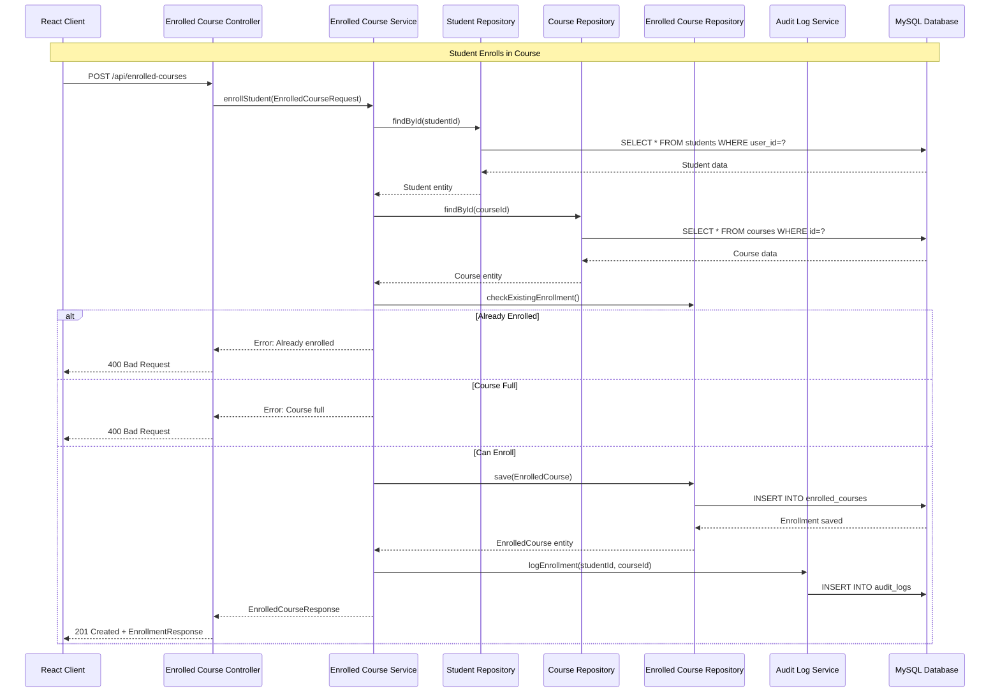
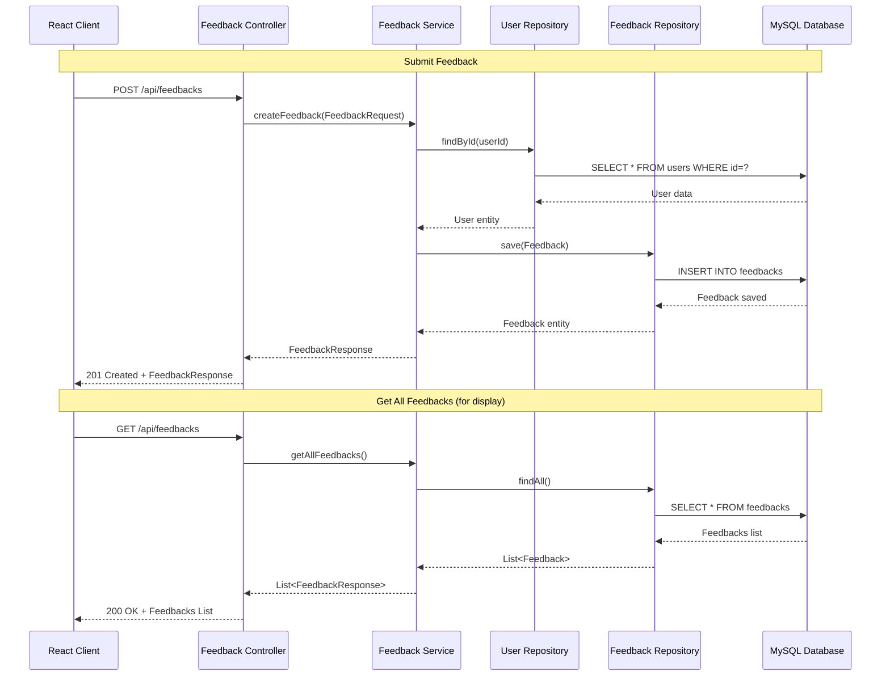
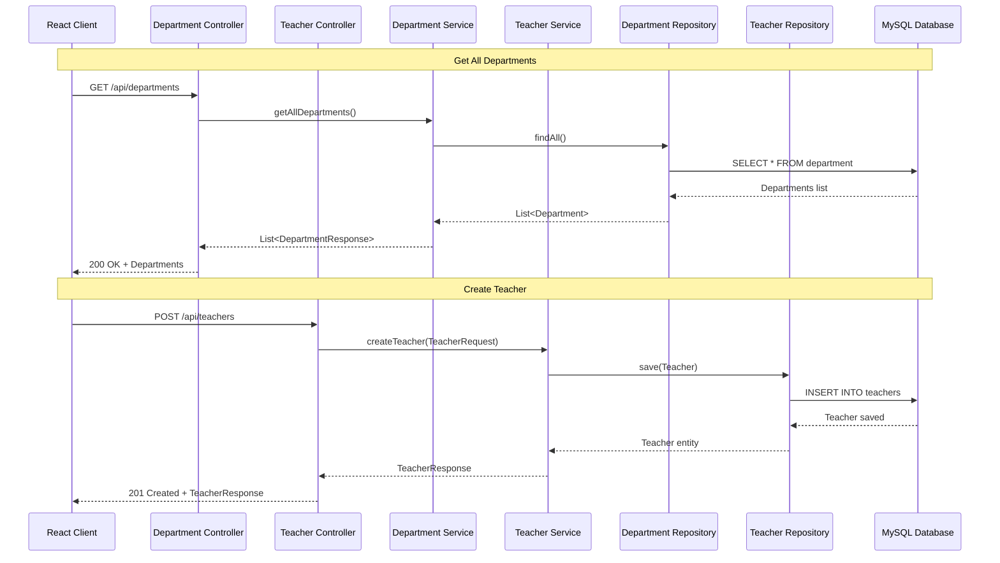

# UniSystem - Sequential Diagrams

This document contains sequence diagrams illustrating the main workflows of the UniSystem application.

## 1. User Registration & Authentication Flow

## 2. Course Management Flow

## 3. Student Enrollment Flow

## 4. Feedback Submission Flow

## 5. Department & Teacher Management Flow

## Technology Stack

### Backend
- **Framework**: Spring Boot 3.4.2
- **Language**: Java 21
- **Security**: Spring Security + JWT (jjwt 0.11.5)
- **Database**: MySQL
- **Cache**: Redis
- **Migration**: Flyway
- **API Documentation**: SpringDoc OpenAPI 2.7.0

### Frontend
- **Framework**: React 19.2.0
- **Build Tool**: Vite 7.3.1
- **Routing**: React Router DOM 7.13.0
- **Styling**: TailwindCSS 4.2.0
- **Animations**: Framer Motion 12.34.3
- **Icons**: Lucide React 0.575.0

### Infrastructure
- **Containerization**: Docker Compose
- **Monitoring**: Spring Boot Actuator
- **Validation**: Jakarta Validation
- **ORM**: Spring Data JPA + Hibernate
