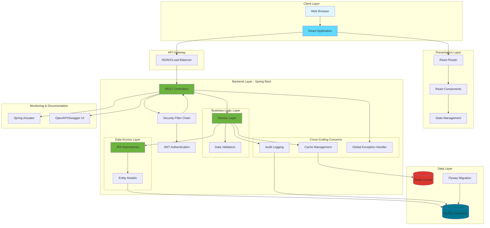
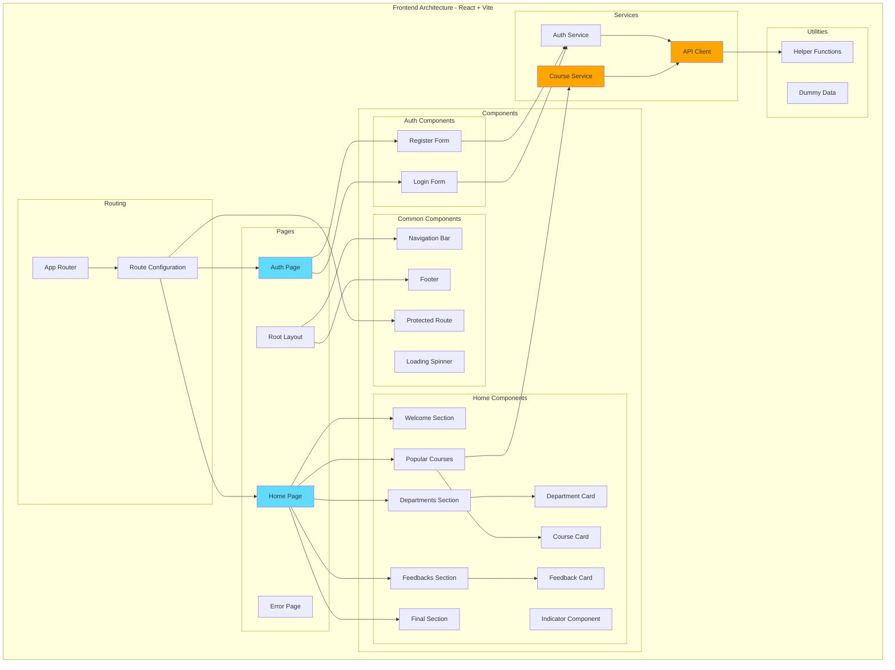
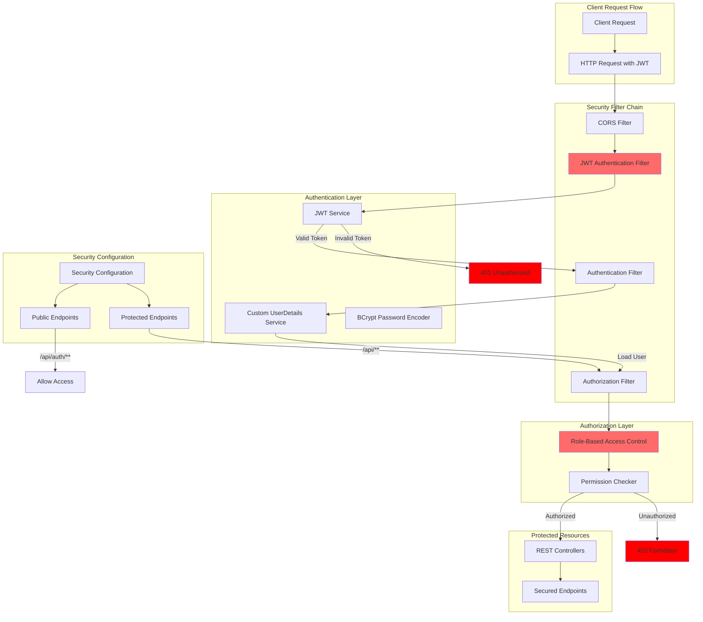
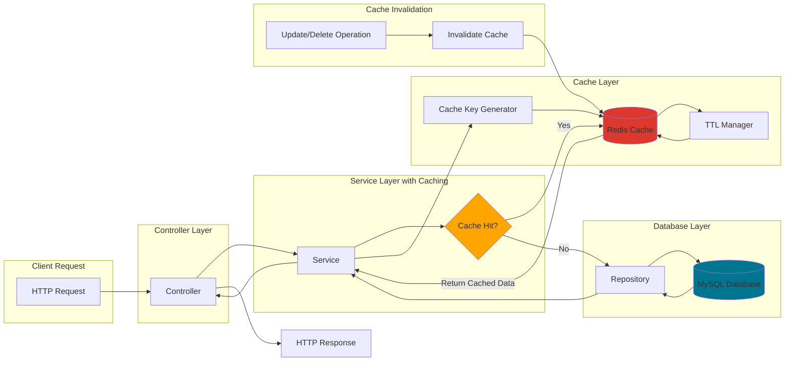

# UniSystem - System Design & Architecture

This document illustrates the complete system architecture and design of the UniSystem application.

## 1. High-Level System Architecture



## 2. Detailed Component Architecture



## 3. Backend Layer Architecture

```mermaid
graph TB
    subgraph "Controller Layer"
        AuthController[Auth Controller]
        UserController[User Controller]
        StudentController[Student Controller]
        TeacherController[Teacher Controller]
        CourseController[Course Controller]
        EnrollController[Enrolled Course Controller]
        DeptController[Department Controller]
        FeedbackController[Feedback Controller]
        AuditController[Audit Log Controller]
    end
    
    subgraph "Service Layer"
        subgraph "Service Interfaces"
            IAuthService[Auth Service Interface]
            IUserService[User Service Interface]
            IStudentService[Student Service Interface]
            ITeacherService[Teacher Service Interface]
            ICourseService[Course Service Interface]
            IEnrollService[Enrolled Course Service Interface]
            IDeptService[Department Service Interface]
            IFeedbackService[Feedback Service Interface]
            IAuditService[Audit Log Service Interface]
        end
        
        subgraph "Service Implementations"
            AuthServiceImpl[Auth Service Impl]
            UserServiceImpl[User Service Impl]
            StudentServiceImpl[Student Service Impl]
            TeacherServiceImpl[Teacher Service Impl]
            CourseServiceImpl[Course Service Impl]
            EnrollServiceImpl[Enrolled Course Service Impl]
            DeptServiceImpl[Department Service Impl]
            FeedbackServiceImpl[Feedback Service Impl]
            AuditServiceImpl[Audit Log Service Impl]
        end
    end
    
    subgraph "Repository Layer"
        UserRepo[User Repository]
        StudentRepo[Student Repository]
        TeacherRepo[Teacher Repository]
        CourseRepo[Course Repository]
        EnrollRepo[Enrolled Course Repository]
        DeptRepo[Department Repository]
        FeedbackRepo[Feedback Repository]
        AuditRepo[Audit Log Repository]
        RoleRepo[Role Repository]
    end
    
    AuthController --> IAuthService
    UserController --> IUserService
    StudentController --> IStudentService
    TeacherController --> ITeacherService
    CourseController --> ICourseService
    EnrollController --> IEnrollService
    DeptController --> IDeptService
    FeedbackController --> IFeedbackService
    AuditController --> IAuditService
    
    IAuthService --> AuthServiceImpl
    IUserService --> UserServiceImpl
    IStudentService --> StudentServiceImpl
    ITeacherService --> TeacherServiceImpl
    ICourseService --> CourseServiceImpl
    IEnrollService --> EnrollServiceImpl
    IDeptService --> DeptServiceImpl
    IFeedbackService --> FeedbackServiceImpl
    IAuditService --> AuditServiceImpl
    
    AuthServiceImpl --> UserRepo
    AuthServiceImpl --> RoleRepo
    UserServiceImpl --> UserRepo
    StudentServiceImpl --> StudentRepo
    TeacherServiceImpl --> TeacherRepo
    CourseServiceImpl --> CourseRepo
    CourseServiceImpl --> DeptRepo
    CourseServiceImpl --> TeacherRepo
    EnrollServiceImpl --> EnrollRepo
    EnrollServiceImpl --> StudentRepo
    EnrollServiceImpl --> CourseRepo
    DeptServiceImpl --> DeptRepo
    FeedbackServiceImpl --> FeedbackRepo
    AuditServiceImpl --> AuditRepo
    
    style AuthController fill:#6db33f
    style AuthServiceImpl fill:#6db33f
    style UserRepo fill:#00758f
```



## 4. Database Schema Architecture

```mermaid
erDiagram
    USERS ||--o{ USER_ROLES : has
    ROLES ||--o{ USER_ROLES : assigned_to
    USERS ||--o| STUDENTS : extends
    USERS ||--o| TEACHERS : extends
    USERS ||--o{ FEEDBACKS : submits
    STUDENTS ||--o{ ENROLLED_COURSES : enrolls
    TEACHERS ||--o{ COURSES : teaches
    DEPARTMENT ||--o{ COURSES : contains
    COURSES ||--o{ ENROLLED_COURSES : has
    USERS ||--o{ AUDIT_LOGS : logged_by
    
    USERS {
        bigint id PK
        varchar user_name UK
        varchar email UK
        varchar password_hash
        boolean active
        timestamp created_at
    }
    
    ROLES {
        bigint id PK
        varchar role_name UK
    }
    
    USER_ROLES {
        bigint user_id FK
        bigint role_id FK
    }
    
    STUDENTS {
        bigint user_id PK_FK
        decimal gpa
        int enrollment_year
        int total_credits
    }
    
    TEACHERS {
        bigint user_id PK_FK
        varchar office_location
        decimal salary
    }
    
    DEPARTMENT {
        bigint id PK
        varchar dep_name UK
    }
    
    COURSES {
        bigint id PK
        varchar course_name UK
        bigint course_dep FK
        int credits
        text course_description
        int capacity
        bigint teacher_id FK
    }
    
    ENROLLED_COURSES {
        bigint id PK
        bigint student_id FK
        bigint course_id FK
        timestamp created_at
    }
    
    FEEDBACKS {
        bigint id PK
        bigint user_id FK
        varchar role
        text comment
        timestamp created_at
        timestamp updated_at
    }
    
    AUDIT_LOGS {
        bigint id PK
        bigint user_id FK
        varchar action_type
        varchar entity_name
        text details
        timestamp created_at
    }
```

## 5. Security Architecture



## 6. Caching Strategy Architecture



## 7. API Structure & Endpoints

```mermaid
graph TB
    subgraph "Public Endpoints"
        AuthAPI[/api/auth]
        Login[POST /login]
        Register[POST /register]
        
        AuthAPI --> Login
        AuthAPI --> Register
    end
    
    subgraph "User Management"
        UserAPI[/api/users]
        GetAllUsers[GET /]
        GetUserById[GET /{id}]
        CreateUser[POST /]
        UpdateUser[PUT /{id}]
        DeleteUser[DELETE /{id}]
        
        UserAPI --> GetAllUsers
        UserAPI --> GetUserById
        UserAPI --> CreateUser
        UserAPI --> UpdateUser
        UserAPI --> DeleteUser
    end
    
    subgraph "Student Management"
        StudentAPI[/api/students]
        GetAllStudents[GET /]
        GetStudentById[GET /{id}]
        GetStudentByUsername[GET /username/{userName}]
        CreateStudent[POST /]
        UpdateStudent[PUT /{id}]
        DeleteStudent[DELETE /{id}]
        
        StudentAPI --> GetAllStudents
        StudentAPI --> GetStudentById
        StudentAPI --> GetStudentByUsername
        StudentAPI --> CreateStudent
        StudentAPI --> UpdateStudent
        StudentAPI --> DeleteStudent
    end
    
    subgraph "Teacher Management"
        TeacherAPI[/api/teachers]
        GetAllTeachers[GET /]
        GetTeacherById[GET /{id}]
        CreateTeacher[POST /]
        UpdateTeacher[PUT /{id}]
        DeleteTeacher[DELETE /{id}]
        
        TeacherAPI --> GetAllTeachers
        TeacherAPI --> GetTeacherById
        TeacherAPI --> CreateTeacher
        TeacherAPI --> UpdateTeacher
        TeacherAPI --> DeleteTeacher
    end
    
    subgraph "Course Management"
        CourseAPI[/api/courses]
        GetAllCourses[GET /]
        GetPopularCourses[GET /popular/{topN}]
        GetCourseById[GET /{id}]
        CreateCourse[POST /]
        UpdateCourse[PUT /{id}]
        DeleteCourse[DELETE /{id}]
        
        CourseAPI --> GetAllCourses
        CourseAPI --> GetPopularCourses
        CourseAPI --> GetCourseById
        CourseAPI --> CreateCourse
        CourseAPI --> UpdateCourse
        CourseAPI --> DeleteCourse
    end
    
    subgraph "Enrollment Management"
        EnrollAPI[/api/enrolled-courses]
        GetAllEnrollments[GET /]
        GetEnrollmentById[GET /{id}]
        CreateEnrollment[POST /]
        DeleteEnrollment[DELETE /{id}]
        
        EnrollAPI --> GetAllEnrollments
        EnrollAPI --> GetEnrollmentById
        EnrollAPI --> CreateEnrollment
        EnrollAPI --> DeleteEnrollment
    end
    
    subgraph "Department Management"
        DeptAPI[/api/departments]
        GetAllDepts[GET /]
        GetDeptById[GET /{id}]
        CreateDept[POST /]
        UpdateDept[PUT /{id}]
        DeleteDept[DELETE /{id}]
        
        DeptAPI --> GetAllDepts
        DeptAPI --> GetDeptById
        DeptAPI --> CreateDept
        DeptAPI --> UpdateDept
        DeptAPI --> DeleteDept
    end
    
    subgraph "Feedback Management"
        FeedbackAPI[/api/feedbacks]
        GetAllFeedbacks[GET /]
        GetFeedbackById[GET /{id}]
        CreateFeedback[POST /]
        UpdateFeedback[PUT /{id}]
        DeleteFeedback[DELETE /{id}]
        
        FeedbackAPI --> GetAllFeedbacks
        FeedbackAPI --> GetFeedbackById
        FeedbackAPI --> CreateFeedback
        FeedbackAPI --> UpdateFeedback
        FeedbackAPI --> DeleteFeedback
    end
    
    subgraph "Audit Management"
        AuditAPI[/api/audit-logs]
        GetAllAudits[GET /]
        GetAuditById[GET /{id}]
        
        AuditAPI --> GetAllAudits
        AuditAPI --> GetAuditById
    end
```

## 8. Deployment Architecture

```mermaid
graph TB
    subgraph "Development Environment"
        DevMachine[Developer Machine]
        LocalDB[(Local MySQL)]
        LocalRedis[(Local Redis)]
        
        DevMachine --> LocalDB
        DevMachine --> LocalRedis
    end
    
    subgraph "Version Control"
        GitHub[GitHub Repository]
    end
    
    subgraph "CI/CD Pipeline"
        GitHubActions[GitHub Actions]
        BuildProcess[Build Process]
        TestSuite[Test Suite]
        DockerBuild[Docker Build]
    end
    
    subgraph "Container Registry"
        DockerHub[Docker Hub / Registry]
    end
    
    subgraph "Production Environment"
        subgraph "Load Balancer"
            LB[NGINX Load Balancer]
        end
        
        subgraph "Application Servers"
            App1[Spring Boot Instance 1]
            App2[Spring Boot Instance 2]
            App3[Spring Boot Instance N]
        end
        
        subgraph "Database Cluster"
            MasterDB[(MySQL Master)]
            SlaveDB1[(MySQL Slave 1)]
            SlaveDB2[(MySQL Slave 2)]
        end
        
        subgraph "Cache Cluster"
            RedisCluster[(Redis Cluster)]
        end
        
        subgraph "Static Assets"
            CDN[CDN for React App]
            S3[S3 / Static Storage]
        end
        
        subgraph "Monitoring"
            Prometheus[Prometheus]
            Grafana[Grafana Dashboard]
            Logs[Centralized Logging]
        end
    end
    
    DevMachine --> GitHub
    GitHub --> GitHubActions
    GitHubActions --> BuildProcess
    BuildProcess --> TestSuite
    TestSuite --> DockerBuild
    DockerBuild --> DockerHub
    DockerHub --> LB
    
    LB --> App1
    LB --> App2
    LB --> App3
    
    App1 --> MasterDB
    App2 --> MasterDB
    App3 --> MasterDB
    
    MasterDB --> SlaveDB1
    MasterDB --> SlaveDB2
    
    App1 --> RedisCluster
    App2 --> RedisCluster
    App3 --> RedisCluster
    
    S3 --> CDN
    
    App1 --> Prometheus
    App2 --> Prometheus
    App3 --> Prometheus
    Prometheus --> Grafana
    
    App1 --> Logs
    App2 --> Logs
    App3 --> Logs
    
    style GitHub fill:#181717
    style DockerHub fill:#2496ed
    style LB fill:#009639
    style MasterDB fill:#00758f
    style RedisCluster fill:#dc382d
    style CDN fill:#ff9900
```



## Technology Stack Summary

### Frontend Technologies
- **Framework**: React 19.2.0
- **Build Tool**: Vite 7.3.1
- **Language**: TypeScript 5.9.3
- **Routing**: React Router DOM 7.13.0
- **Styling**: TailwindCSS 4.2.0
- **Animations**: Framer Motion 12.34.3
- **Icons**: Lucide React 0.575.0
- **HTTP Client**: Fetch API

### Backend Technologies
- **Framework**: Spring Boot 3.4.2
- **Language**: Java 21
- **Build Tool**: Maven
- **Web**: Spring Boot Starter Web
- **Security**: Spring Security + OAuth2 Client
- **Authentication**: JWT (jjwt 0.11.5)
- **ORM**: Spring Data JPA + Hibernate
- **Database**: MySQL with Flyway Migration
- **Cache**: Spring Data Redis
- **Validation**: Jakarta Validation
- **AOP**: Spring Boot Starter AOP
- **Documentation**: SpringDoc OpenAPI 2.7.0
- **Monitoring**: Spring Boot Actuator
- **Utilities**: Lombok 1.18.32

### Infrastructure
- **Containerization**: Docker + Docker Compose
- **Reverse Proxy**: NGINX (recommended)
- **Database**: MySQL
- **Cache**: Redis
- **Monitoring**: Spring Actuator + Prometheus + Grafana (optional)

### Development Tools
- **Version Control**: Git
- **API Testing**: Swagger UI / Postman
- **Database Migration**: Flyway
- **Hot Reload**: Spring DevTools, Vite HMR

## Design Patterns Used

1. **Layered Architecture**: Clear separation between Controller, Service, and Repository layers
2. **Dependency Injection**: Spring's IoC container for loose coupling
3. **Repository Pattern**: Data access abstraction through Spring Data JPA
4. **DTO Pattern**: Data Transfer Objects for API communication
5. **Builder Pattern**: Lombok @Builder for entity construction
6. **Strategy Pattern**: Different authentication strategies
7. **Proxy Pattern**: JPA lazy loading, Spring AOP
8. **Singleton Pattern**: Spring beans as singletons by default
9. **Template Method Pattern**: Spring's JdbcTemplate, RestTemplate patterns
10. **Factory Pattern**: Entity and DTO creation
